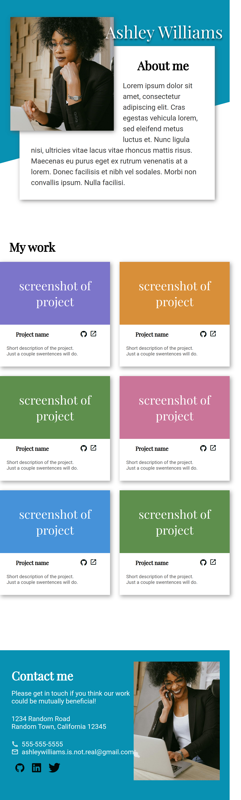
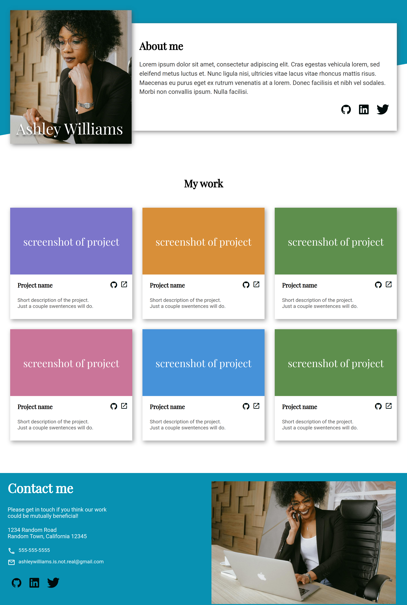

# Homepage

 
 
 

:point_right: [live demo](https://cmfernandes.github.io/homepage/) 

---

## About

The main purpose of this project was to create a responsive homepage to mobile, tablet and desktop version.

Assigment from [The Odin Project](https://www.theodinproject.com/lessons/node-path-advanced-html-and-css-homepage) Advanced HTML and CSS course. 